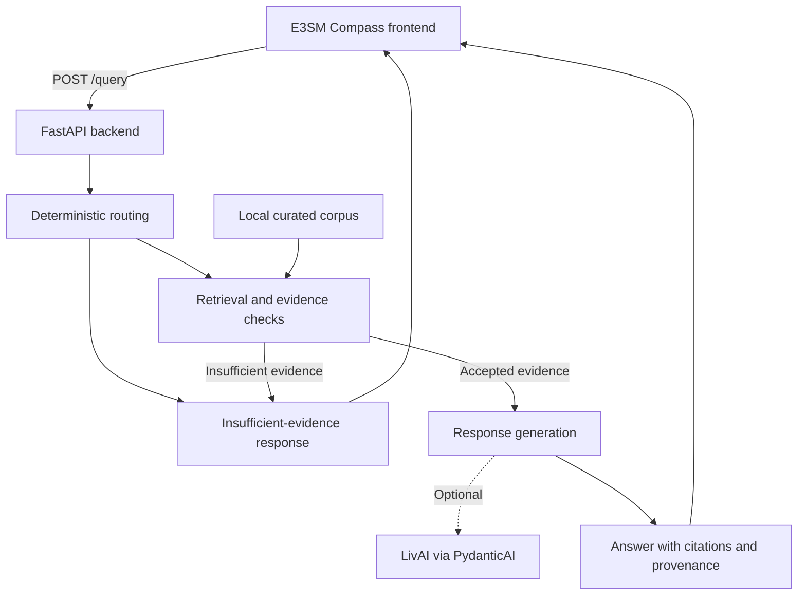

# E3SM AI Platform

E3SM AI Platform is the provider-independent backend prototype for **E3SM Compass**, a chat application that answers E3SM questions using a curated documentation corpus.

Answers include citations and source provenance. When the available evidence is insufficient, the application explicitly says so. This prototype is not a complete E3SM documentation service or a production operational assistant.

## Quickstart

### Prerequisites

- Python 3.13
- [uv](https://docs.astral.sh/uv/)
- Node.js 22 and npm

### Start the application

From the repository root, install dependencies and start the API:

```bash
make sync
make backend-start
```

In a second terminal, start the web client:

```bash
make frontend-start
```

Open the local URL printed by Vite.

To query the API directly:

```bash
curl -X POST http://localhost:8000/query \
  -H 'Content-Type: application/json' \
  -d '{"question":"How do I choose an E3SM compset?"}'
```

After dependencies are installed, the default configuration runs and tests locally without proprietary services or external network requests. It uses the packaged corpus, lexical retrieval, and deterministic response generation.

See [Developer setup](docs/dev/setup.md) for optional retrieval modes and LivAI configuration.

## Features

- **Curated E3SM knowledge:** A 31-entry corpus covering the E3SM User Guide, Running E3SM, EAM, EAMxx, ELM, Diagnostics, and E3SM-Unified.
- **Configurable retrieval:** Deterministic lexical retrieval by default, with optional semantic and hybrid modes using LlamaIndex and Hugging Face embeddings.
- **Evidence-based answers:** Relevance checks, citations, source provenance, and explicit insufficient-evidence responses.
- **API and chat UI:** A FastAPI `POST /query` endpoint and React/TypeScript frontend with loading and error states, expandable evidence, and route/source debugging.
- **Optional LLM generation:** Backend-only LivAI integration through PydanticAI. Deterministic generation remains the default and fallback.
- **Evaluation:** Deterministic pytest fixtures validate routing, evidence, and citation behavior.
- **Observability:** Structured JSON logs, request IDs, and OpenTelemetry tracing with privacy-preserving defaults. An optional Collector and Jaeger stack supports local trace inspection.

Provider-independent interfaces support retrieval, generation, and future web and operational connectors. Live web and operational integrations are not bundled.

## How it works

The frontend sends questions to `POST /query`. During development, Vite proxies these requests to the backend.



For supported documentation questions, the backend:

1. Retrieves and ranks passages from the curated corpus.
2. Applies relevance and coherence checks to select acceptable evidence.
3. Generates a response using the deterministic generator or optional LivAI integration.
4. Returns the answer with citations, provenance, and route/debug metadata.

Unsupported questions or questions without adequate evidence receive an explicit insufficient-evidence response.

The default `lexical` mode does not initialize or download an embedding model. Optional `semantic` mode uses dense embeddings; `hybrid` mode combines lexical and semantic relevance.

Ingestion runs separately from queries: source records are normalized, chunked, and stored for retrieval, with embeddings handled through an abstraction. The application does not fetch documentation at request time.

See [Architecture](docs/dev/architecture.md) for routing, ingestion, retrieval scoring, and evidence thresholds.

## Development commands

| Task                                                                 | Command                                                              |
| -------------------------------------------------------------------- | -------------------------------------------------------------------- |
| Synchronize all Python and frontend dependencies                     | `make sync`                                                          |
| Synchronize backend Python dependencies only                         | `make backend-sync`                                                  |
| Synchronize frontend dependencies only                               | `make frontend-sync`                                                 |
| Run backend and evaluation tests, lint, and type checks              | `make check`                                                         |
| Run frontend tests, lint, type checks, and production build          | `make frontend-test frontend-lint frontend-typecheck frontend-build` |
| Start the API                                                        | `make backend-start`                                                 |
| Start the web client                                                 | `make frontend-start`                                                |
| Remove generated builds, retrieval data, caches, and Python bytecode | `make clean`                                                         |
| Start the local tracing stack                                        | `make observability-up`                                              |
| Check tracing stack status                                           | `make observability-status`                                          |
| View tracing stack logs                                              | `make observability-logs`                                            |
| Stop the tracing stack                                               | `make observability-down`                                            |

The optional tracing stack uses Docker Compose. See [Observability](docs/dev/observability.md) for setup.

## Project layout

| Directory               | Contents                                                                               |
| ----------------------- | -------------------------------------------------------------------------------------- |
| `backend/`              | FastAPI service, ingestion, retrieval, routing, generation, and integration interfaces |
| `frontend/`             | React, TypeScript, and Vite chat client                                                |
| `evaluation/`           | Deterministic question fixtures and scoring checks                                     |
| `deploy/observability/` | Local OpenTelemetry Collector and Jaeger configuration                                 |
| `docs/`                 | User and developer documentation, prototype status, and roadmap                        |

## Limitations

- The corpus is small and may not reflect current E3SM documentation. Answer quality depends on coverage, chunking, and retrieval configuration.
- Web and operational connectors are extension points without bundled live production implementations.
- Authentication, access control, and persistent conversation history are not implemented.
- Optional LivAI requires backend-only credentials. Never place secrets in the frontend or commit them. See [Developer setup](docs/dev/setup.md).

## Documentation

- [Documentation index](docs/README.md)
- [Usage guide](docs/user/usage.md)
- [Developer setup](docs/dev/setup.md)
- [Architecture](docs/dev/architecture.md)
- [Evaluation](docs/dev/evaluation.md)
- [Observability](docs/dev/observability.md)
- [Corpus curation](docs/dev/corpus-curation.md)
- [Prototype status](docs/dev/prototype-status.md)
- [Roadmap](docs/roadmap.md)
