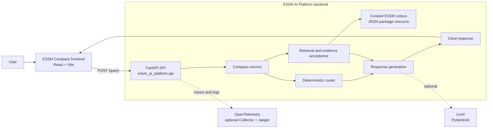

# E3SM AI Platform

E3SM AI Platform is a provider-independent prototype for **E3SM Compass**: a chat application that answers E3SM questions from a curated local documentation corpus. It prioritizes traceable evidence, citations, and explicit insufficient-evidence responses over unsupported answers. It is a prototype, not a complete E3SM documentation service or production operational assistant.

## Current features

### RAG and indexing

- Curated 31-entry corpus spanning the E3SM User Guide, Running E3SM, EAM,
  EAMxx, ELM, Diagnostics, and E3SM-Unified. *(JSON, Pydantic)*
- Deterministic lexical retrieval by default, with configurable semantic and
  hybrid retrieval modes. *(LlamaIndex, Hugging Face embeddings)*
- Evidence acceptance, citations, provenance, and explicit
  insufficient-evidence responses. *(Pydantic)*

### Backend and generation

- FastAPI `POST /query` service with deterministic routing and response
  generation. *(FastAPI, Uvicorn)*
- Optional backend-only LivAI generation for curated-evidence answers; the
  deterministic generator remains the default and fallback. *(PydanticAI,
  LivAI)*
- Provider-independent interfaces for retrieval, generation, web, and
  operational-source extensions. *(Python protocols)*

### Frontend

- E3SM Compass chat UI with loading and error states, citations, expandable
  evidence, and route/source debugging. *(React, TypeScript, Vite)*

### Evaluation

- Deterministic evaluation fixtures that validate routing, evidence, and
  citation behavior. *(pytest)*

### Observability

- Structured request-completion logs, request IDs, and distributed tracing with
  privacy-preserving telemetry defaults. *(OpenTelemetry, JSON logging)*
- Optional local trace inspection stack for development. *(OpenTelemetry
  Collector, Jaeger, Docker Compose)*

## Prerequisites

- Python 3.13
- [uv](https://docs.astral.sh/uv/)
- Node.js 22 and npm

## Quickstart

From the repository root, install dependencies and start the API:

```bash
uv sync --all-packages --all-groups
make frontend-install
make backend-start
```

In a second terminal, start the web client:

```bash
make frontend-start
```

Send a request to the API:

```bash
curl -X POST http://localhost:8000/query \
  -H 'Content-Type: application/json' \
  -d '{"question":"How do I choose an E3SM compset?"}'
```

The default configuration uses local curated-corpus data; it does not require a proprietary service or network request to run or test.

## Standard commands

```bash
# Run backend, evaluation, lint, and type checks
make check

# Run frontend checks and production build
make frontend-test frontend-lint frontend-typecheck frontend-build

# Run individual services
make backend-start
make frontend-start

# Remove generated builds, retrieval data, test and tool caches, and Python bytecode
make clean

# Manage the optional local observability stack
make observability-up
make observability-status
make observability-logs
make observability-down
```

## Architecture and request flow

`frontend/` sends a question to the FastAPI backend's `POST /query` endpoint (the Vite development server proxies relative `/query` requests). The backend deterministically selects a route, retrieves relevant curated evidence when supported, generates an evidence-constrained response, and returns the answer with citations, provenance, route metadata, and debug information. Ingestion is an explicit process: source records are normalized, chunked, embedded through an abstraction, and stored for retrieval; the application does not fetch documentation at request time.



Available routes are curated documentation, opt-in web-search fallback, future operational/tool sources, and explicit insufficient evidence. Web and operational connectors are extension points and are not enabled by default.

### Answer process

E3SM Compass uses retrieval-augmented generation (RAG) to:

1. Search the curated E3SM documentation corpus for relevant passages.
2. Rank candidates with the configured retrieval mode. Offline-safe `lexical`
   mode uses lexical similarity, query-term coverage, metadata matches, and
   E3SM-specific phrase boosts. Opt-in `semantic` mode uses Hugging Face dense
   embeddings, while `hybrid` mode deterministically combines lexical relevance
   and semantic similarity.
3. Filter results to official evidence that clears the configured lexical or
   semantic relevance gates and is coherent with the accepted set. Unsupported
   requests are rejected regardless of retrieval mode.
4. Pass accepted evidence to the deterministic generator or the optional LLM,
   then produce a cited answer. If no evidence passes these safeguards, return an
   explicit insufficient-evidence response.

Lexical mode is the default and does not initialize or download an embedding
model. See [developer setup](docs/dev/setup.md) and
[architecture](docs/dev/architecture.md) for retrieval configuration, scoring,
and threshold details.

## Project layout

- `backend/` — FastAPI service, ingestion, retrieval, routing, generation, and integration interfaces.
- `frontend/` — React/Vite chat client.
- `evaluation/` — deterministic question fixtures and scoring checks.
- `deploy/observability/` — local development Collector and Jaeger configuration.

## Limitations

- The prototype corpus is small and is not a complete substitute for current E3SM documentation.
- Retrieval quality is limited by corpus coverage, chunking, and the local embedding implementation.
- Web and operational integrations have no bundled credentials or live production implementation.
- There is no authentication, persistent conversation history, or access control.
- Optional LivAI requires backend-only secret provisioning; do not put credentials in the frontend or commit them. See the setup documentation below.

## Detailed documentation

- [Documentation index](docs/README.md)
- [User usage guide](docs/user/usage.md)
- [Developer setup](docs/dev/setup.md)
- [Architecture](docs/dev/architecture.md)
- [Evaluation](docs/dev/evaluation.md)
- [Observability](docs/dev/observability.md) — includes the optional local tracing workflow.
- [Corpus curation](docs/dev/corpus-curation.md) — approved source scope and offline curation workflow.
- [Prototype status](docs/dev/prototype-status.md)
- [Roadmap](docs/roadmap.md)

For optional LivAI configuration, use the backend-only guidance in the [developer setup](docs/dev/setup.md). For tracing, use the [observability guide](docs/dev/observability.md).
