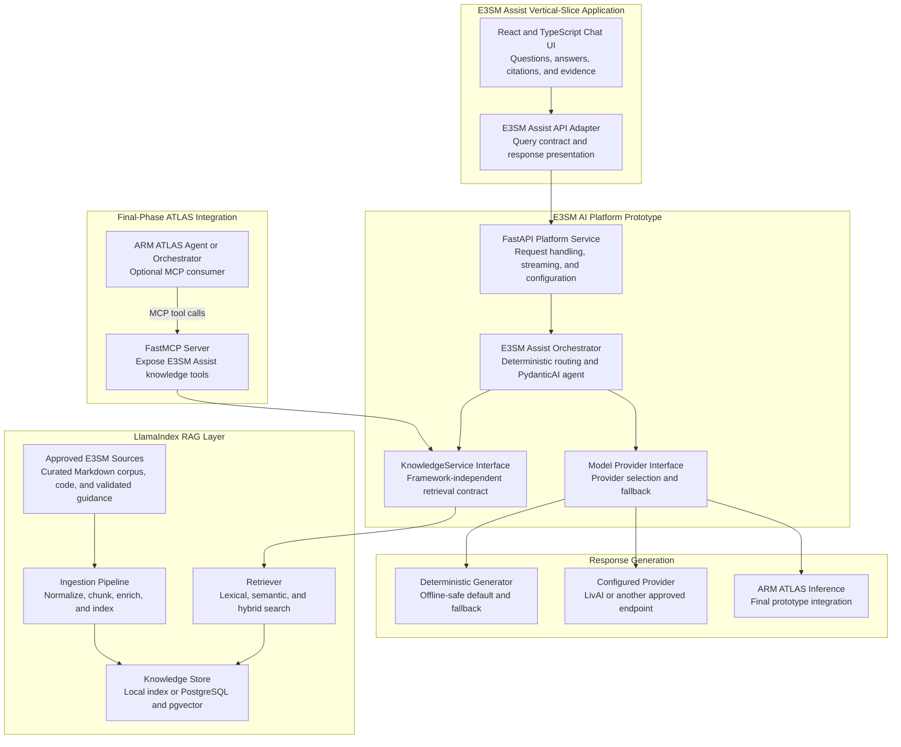
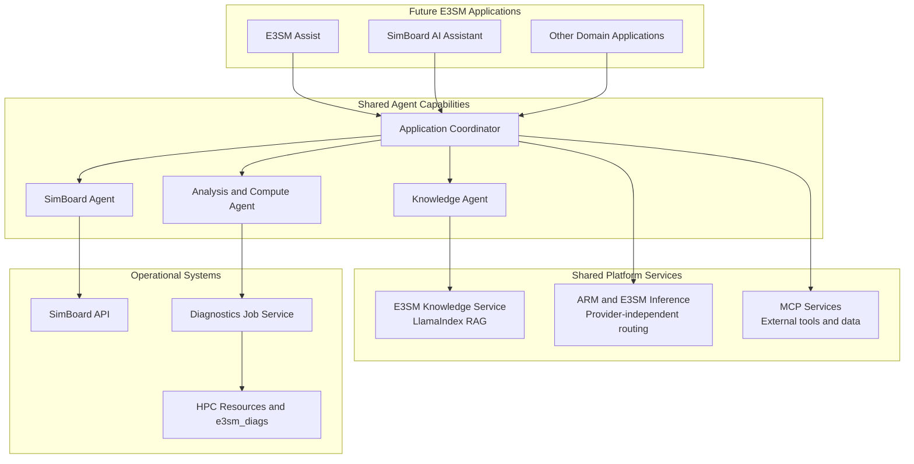

# E3SM AI Platform Prototype Architecture and Phased Development

## Purpose

The E3SM AI Platform prototype provides the reusable backend capabilities for E3SM AI applications, including provider-independent inference, knowledge retrieval, agent interfaces, evaluation, and external integration boundaries.

E3SM Assist is the first vertical-slice application built on that foundation. It is a provider-independent chat application that answers E3SM questions from a curated, authoritative knowledge base and prioritizes traceable evidence, citations, and explicit insufficient-evidence responses over unsupported answers.

The platform prototype and E3SM Assist are connected but not synonymous. Platform capabilities are developed only as required to support and evaluate the E3SM Assist vertical slice. SimBoard, scientific analysis, compute execution, and broader multi-agent orchestration remain future backlog items.

## Prototype Scope

### In scope

- Reusable E3SM AI Platform interfaces for knowledge, inference, agents, evaluation, and external integrations.
- E3SM Assist web chat experience.
- Curated E3SM documentation ingestion and retrieval.
- Evidence-constrained answers with citations and provenance.
- Provider-independent generation with deterministic fallback.
- Retrieval and response evaluation.
- A focused E3SM Assist agent using typed tools and outputs.
- ARM ATLAS inference and MCP integration as the final prototype phase.

### Out of scope

- SimBoard AI Assistant integration.
- Running `e3sm_diags` or other scientific analyses.
- HPC job submission and monitoring.
- A generalized multi-application or multi-agent orchestration platform.
- Production-wide identity, governance, service ownership, and operational support.

## Target Prototype Architecture

The E3SM Assist application uses the E3SM AI Platform prototype through its API contract. The platform owns the agent, knowledge, inference-provider, evaluation, and integration abstractions needed by the application.

ATLAS inference and MCP serve different purposes. The platform accesses ARM-hosted models through the model-provider interface and the inference API made available through ATLAS. FastMCP separately exposes E3SM Assist knowledge capabilities, such as retrieval, to an ATLAS agent or other approved MCP clients. The exact ATLAS API and authentication contract must be confirmed during the final prototype phase.

## Technologies and Responsibilities

| Technology | Description | Responsibility | Phase |
|---|---|---|---|
| **E3SM AI Platform interfaces** | Current provider-independent abstractions for retrieval, generation, web, and operational extensions. | Form the reusable platform boundary while preserving replaceable implementations and deterministic testing. | **Phase 1: implemented** |
| **React, TypeScript, and Vite** | Current E3SM Assist web client. | Provide the chat experience and display citations, evidence, errors, and optional debug information. | **Phase 1: implemented** |
| **FastAPI** | Python web framework used by the current `POST /query` service. | Provide request handling, configuration, and response delivery to the web client. | **Phase 1: implemented** |
| **Current retrieval pipeline** | Deterministic lexical retrieval with optional semantic and hybrid modes. | Provide the evaluation baseline and offline-safe retrieval implementation. | **Phase 1: implemented** |
| **LlamaIndex** | Data and RAG framework for ingestion, indexing, retrieval, and citations. | Implement the maintainable E3SM knowledge layer behind `KnowledgeService`. | **Phase 3** |
| **Local index or PostgreSQL/pgvector** | Storage options for document chunks, embeddings, metadata, and ingestion state. | Persist the knowledge index at a level appropriate for prototype scale. | **Phase 3** |
| **PydanticAI** | Provider-independent agent framework using typed dependencies, tools, and structured outputs. | Implement the focused E3SM Assist agent without introducing a general orchestration framework. | **Phase 4** |
| **LivAI or other configured provider** | Optional backend-only model provider. | Evaluate evidence-constrained LLM generation while retaining deterministic fallback. | **Phase 1-4** |
| **ARM ATLAS inference** | ARM-managed inference layer and associated LLM/GPU resources. | Provide the final prototype inference integration through the model-provider interface. | **Phase 5** |
| **FastMCP** | Python framework for creating and consuming Model Context Protocol services. | Expose selected E3SM Assist knowledge tools for ATLAS integration testing. | **Phase 5** |

## Phased Development

### Phase 1: E3SM Assist Vertical Slice and Platform Baseline

**Status:** Implemented in the starter repository.

Maintain the working, locally runnable E3SM Assist application while treating its provider-independent backend interfaces as the initial E3SM AI Platform baseline.

- React/Vite client and FastAPI `POST /query` service.
- Seed 31-entry E3SM documentation corpus.
- Deterministic routing and lexical retrieval by default.
- Optional semantic and hybrid retrieval.
- Evidence-constrained answers, citations, provenance, and explicit insufficient-evidence responses.
- Deterministic evaluation fixtures and optional local observability.
- Deterministic generation by default with optional backend-only LivAI generation.
- Provider-independent retrieval, generation, web, and operational-source interfaces that later platform implementations can satisfy.

**Exit criteria:** The current request and response contract, evaluation results, limitations, and retrieval failure modes are documented and reproducible.

### Phase 2: Documentation Corpus Curation and Knowledge Foundation

Create a reproducible, authoritative E3SM documentation corpus before changing the production retrieval implementation.

- Define an approved documentation-source manifest with source URLs, ownership, release or version, crawl scope, licensing or access constraints, and refresh cadence.
- Crawl the approved E3SM documentation website(s), respecting site policies and rate limits; prefer an official source export or repository when one is available.
- Download pages as Markdown when the site supports it; otherwise convert the rendered documentation to normalized Markdown while retaining the canonical URL and source snapshot.
- Extract relevant Markdown pages and sections, excluding navigation, boilerplate, duplicate content, stale versions, generated indexes, and material outside the approved scope.
- Curate the extracted corpus with subject-matter review, stable identifiers, document titles, headings, E3SM component and release metadata, canonical URLs, and source hashes.
- Establish a versioned raw-source archive and a cleaned, reviewable Markdown corpus so every future chunk and citation can be traced to its original page and retrieval-ready representation.
- Add validation and refresh workflows that identify added, changed, removed, duplicate, or broken-source pages before corpus updates are accepted.

**Exit criteria:** A reviewed, versioned Markdown corpus exists for the approved E3SM documentation scope, with source provenance, quality checks, and a repeatable crawl, extraction, curation, and refresh process.

### Phase 3: Shared E3SM Knowledge Foundation

Strengthen the platform's RAG capability while preserving the E3SM Assist application contract and offline test path.

- Introduce LlamaIndex behind the existing `KnowledgeService` interface.
- Ingest the Phase 2 curated Markdown corpus through a controlled source manifest.
- Improve chunking, metadata, versioning, provenance, and citation handling.
- Add repeatable ingestion and incremental update workflows.
- Evaluate lexical, semantic, hybrid, and reranking strategies against the existing fixtures.
- Select local storage or PostgreSQL/pgvector based on demonstrated corpus and operational requirements.
- Retain deterministic retrieval fixtures so tests do not depend on external services.

**Exit criteria:** The knowledge layer improves corpus coverage and retrieval evaluation without weakening citations, provenance, offline testing, or insufficient-evidence behavior.

### Phase 4: Focused E3SM Assist Agent

Add agent capabilities to the platform only where they measurably improve E3SM Assist.

- Introduce a single PydanticAI-based E3SM Assist agent behind the existing API.
- Keep deterministic routing for requests that can be classified reliably without an LLM.
- Give the agent typed tools for knowledge retrieval and other narrowly approved read-only sources.
- Use structured outputs for answers, citations, provenance, and insufficient-evidence decisions.
- Preserve provider independence and deterministic generation fallback.
- Evaluate whether the agent improves answer quality, routing, and maintainability relative to the Phase 1 baseline.

**Exit criteria:** The agent demonstrates measurable value over the deterministic pipeline without reducing traceability, reliability, or provider independence.

### Phase 5: ARM ATLAS Integration

Complete the platform prototype by evaluating integration with ARM's production-scale AI infrastructure through E3SM Assist.

- Confirm the ATLAS inference API, authentication, supported models, streaming, quotas, data-handling constraints, and availability expectations.
- Implement ATLAS as another model provider behind the existing model interface.
- Preserve deterministic and alternative-provider fallbacks so E3SM Assist does not depend exclusively on ATLAS.
- Expose a minimal FastMCP surface, initially `search_e3sm_knowledge` and optionally `ask_e3sm`.
- Test whether an ATLAS agent can consume E3SM Assist knowledge tools through MCP.
- Compare response quality, latency, resource requirements, and operational complexity with the existing provider options.
- Document which responsibilities should remain with E3SM and which can be delegated to ARM infrastructure.

**Exit criteria:** E3SM Assist demonstrates and evaluates the platform's ATLAS inference and MCP integrations while preserving E3SM control of its curated knowledge layer and application contract.

## Architectural Boundaries

- The E3SM AI Platform prototype is the reusable backend foundation; E3SM Assist is its only implemented vertical-slice application.
- Platform capabilities are added only when required to support or evaluate E3SM Assist.
- The frontend communicates through HTTP and streaming APIs, not directly with PydanticAI, LlamaIndex, FastMCP, or ATLAS.
- Existing provider-independent interfaces remain the migration boundary; framework-specific objects do not become public API contracts.
- LlamaIndex remains an implementation detail behind `KnowledgeService`.
- PydanticAI implements one focused assistant agent, not a generalized multi-agent platform.
- ATLAS inference is accessed through the model-provider interface, not MCP, unless ARM explicitly exposes inference as an MCP capability.
- FastMCP is used only at the external integration boundary.
- Deterministic retrieval and generation paths remain available for offline development, testing, and fallback.

## Future Backlog

The following items may build on the prototype after E3SM Assist demonstrates value, but they are not part of its phased development scope:

- SimBoard AI Assistant and live simulation metadata integration.
- Scientific analysis agents that configure or interpret `e3sm_diags`.
- Compute agents, HPC job submission, monitoring, and durable execution.
- Generalized multi-agent coordination across E3SM applications.
- A2A delegation between independently operated ARM and E3SM agents.
- Production-wide authentication, authorization, governance, service ownership, and support.
- E3SM-managed inference resources for specialized analysis and compute use cases.

## Envisioned Architecture

If future backlog items are justified, the E3SM AI Platform prototype could evolve into a shared platform supporting E3SM Assist and other applications. The following architecture is directional only and does not define the current prototype scope.

